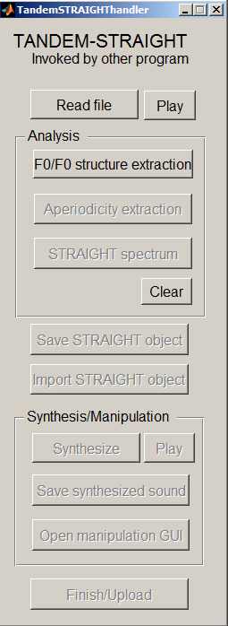
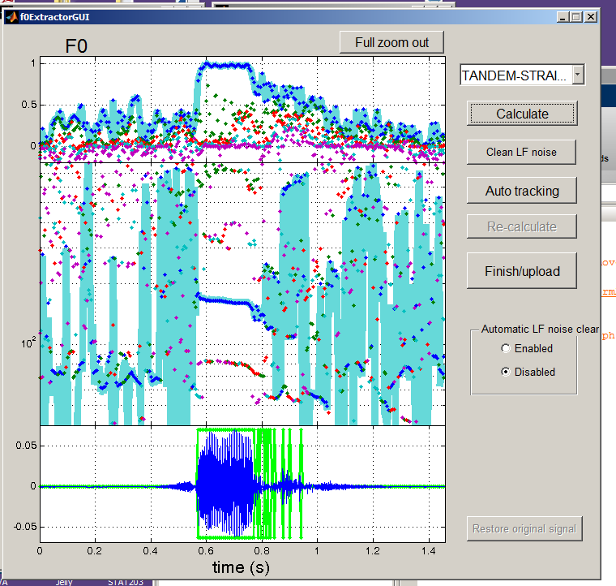
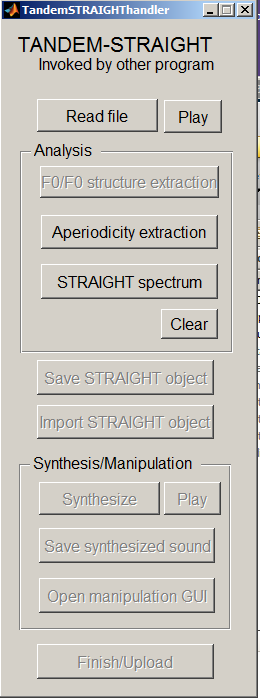
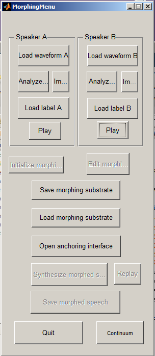
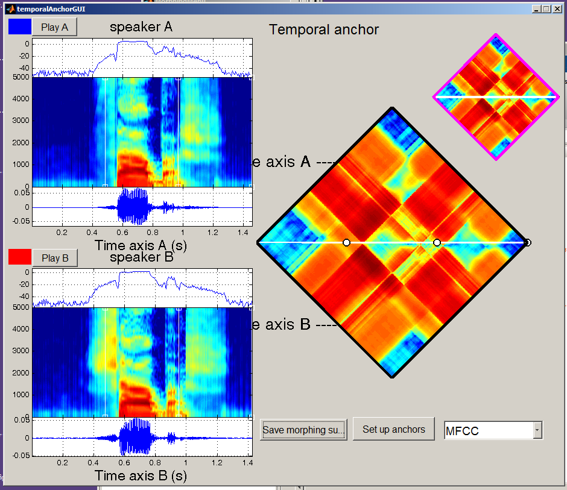
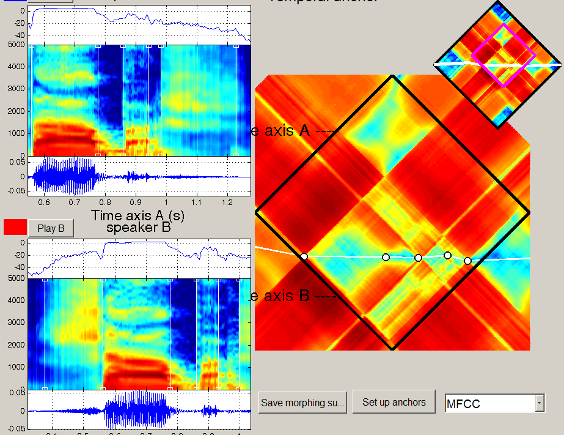
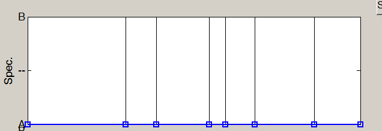
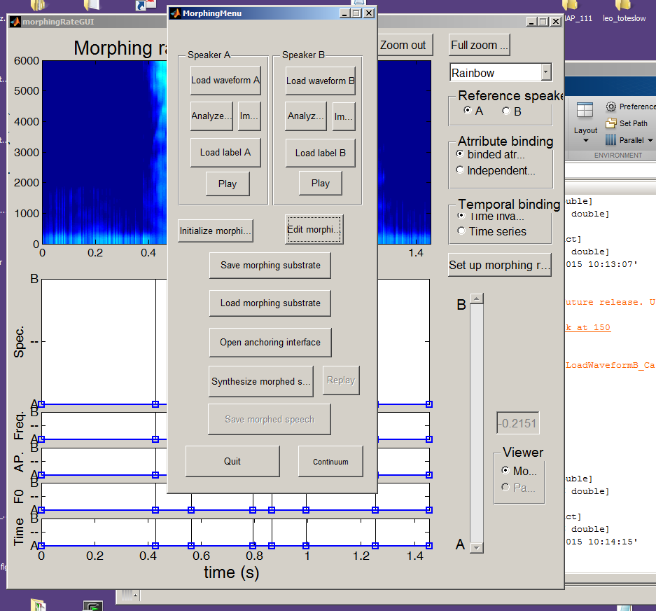
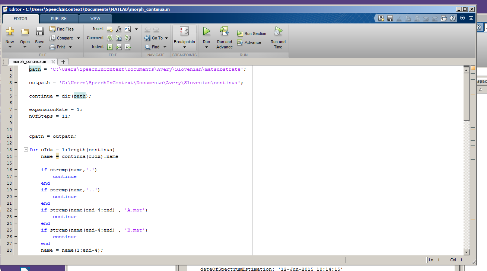

## STRAIGHT

[Home page](http://www.wakayama-u.ac.jp/~kawahara/STRAIGHTadv/index_e.html)

### Tutorial

1. Open Matlab with STRAIGHT on it.

2. Type MorphingMenu and hit enter. A new window will pop up.

3. Click "Load waveform" on the lefthand side of the box. Browse to the first audio file you want.

4. Click “Analyze”. A new window will pop up. 

5. Click “F0/F0 structure extraction”. A new window will pop up.

6. Click  “Calculate”. Wait until the image of a pitch track appears.

7. Click “Auto tracking”. 

8. At the bottom part of this window, there should be a waveform with green boxes. These green boxes need to be aligned with the voiced segments (vowels and voiced consonants) in the waveform. To zoom in, left click on the x-axis. To zoom out, hold shift and left click on the x-axis. Move the green boxes by dragging the edges until they are aligned with the voiced parts. Also make sure there are no extra green boxes. You can get rid of them by dragging the borders together. 

9. Click “Finish/Upload”.  This will close the window with the pitch track and waveform.

10. Click “Aperiodicity extraction” in the window where you clicked “F0/F0 structure extraction”. 

11. Click “STRAIGHT spectrum” in that same window. 

12. Click “Save STRAIGHT object”. Browse to where you want to save it. I suggest a folder called “matsynth”. Give it a name and save.

13. Hit “Finish/Upload”. This will close this window. 

14. Click “Load waveform” on the righthand side of the original MorphingMenu window. Browse to the second audio file you want to use. Then repeat steps 4 to 13 with that file.  

NOTE 1: If you already have the synthesized file and need to go back to it later, you can do so using “Import” instead of “Load waveform” in the MorphingMenu window. 

15.  Hit “Play” on either of the two sides to refresh the window. 

16. Click “Open anchoring interface”. This will open a new window.

17. Click “Calculate distance matrix”. Wait until the image appears on the right.

18. Use the small square at the top to zoom in and out (zoom in by left clicking, zoom out by holding shift and left clicking). 

19. Add new markers to the line in the larger box on the right by clicking the line. (Remove them by shift + click). You want one marker for the beginning and end of each sound. Use the spectrograms at the left to align the markers, and use F2/F3 as markers for where vowels start and end. 

20. Click “Save morphing substrate”. Browse to where you want to save it. I suggest a folder called “matsubstrate”. Give it a name and save it. Then close the distance matrix window. 

21. In the original MorphingMenu window, click “Load morphing substrate”. Browse to the file you just saved and load it. 

22. Click “Initialize morphing rate”. 

23. Click “Edit morphing rate”. A new box will come up. 

24. In the first of the boxes with lines, move the line all the way down to A. 

25. Click “Set up morphing rate”.  This will take you back to the MorphingMenu window.

26. Click “Save morphing substrate”. Navigate to where you saved the previous substrate, and save this with the same name but with A at the end (e.g. sabash_shabashA). 

27. Click “Edit morphing rate” again. 

28. This time, move the line all the way up to B. 

29. Click “Set up morphing rate” again.

30. Click “Save morphing substrate”. Again, navigate to where you saved the previous substrate, and save this one with a B at the end (e.g. sabash_shabashB). 

31. Quit the MorphingMenu. You can now repeat these steps for as many continua as you need to make. Do these steps for all the continua you’re making before continuing to Step 32. 

32. From Matlab, open morph.continua.m (in document/matlab).

33. In the first few lines of the script that opens, set the path to
where you saved the substrates and the outpath to where you want the
continua to appear. Also set the number of steps you want.

34. Click “Run”. Once it finishes running, all the continua should be
in the folder you specified as the outpath.

NOTE: If you get an error message when you run the morph continua script,
it usually works to go back to the stage where you create the substrate.
Import the two matsynth files as specified in Note 1, then follow the
remaining steps to redo the alignment and the substrates. Then try
re-running the continua script. 

## Splicing

To come soon!